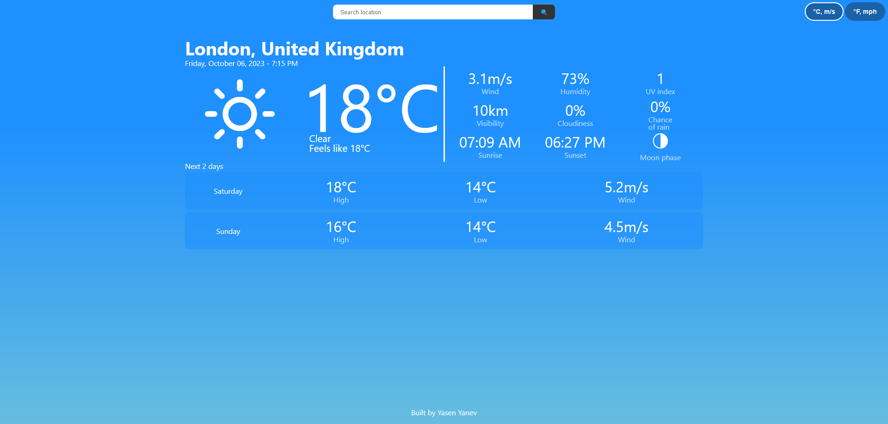

<!-- ABOUT THE PROJECT -->

## About The Project

Weather app created with HTML, CSS and JS.

[Live Demo](https://yasenyanev.github.io/weather-app/)



Learning project from [The Odin Project](https://www.theodinproject.com/lessons/node-path-javascript-weather-app) curriculum.

### Features

- Explore cities across the globe.
- Retrieve the present and next two days' weather outlook.
- Toggle between the imperial and metric measurement systems.
- Ensure adaptability across different screen sizes with responsive design.

### Built With

#### Technologies

- JavaScript
- CSS
- HTML

#### Third party code

- [date-fns](https://date-fns.org/)
- [loading.io](https://loading.io/)

#### Tools

- Visual Studio Code
- Git and GitHub
- Webpack
- ESLint + Airbnb JavaScript Style Guide
- Prettier

<!-- GETTING STARTED -->

## Getting Started

These instructions will get you a copy of the project up and running on your local machine for development and testing purposes.

### Prerequisites

You will need `Node.js` and `npm` installed globally on your machine.

- [Downloading and installing Node.js and npm](https://docs.npmjs.com/downloading-and-installing-node-js-and-npm)

### Installation

1. Get a free API key at [https://www.weatherapi.com](https://www.weatherapi.com)
2. Clone the repo
   ```sh
   git clone https://github.com/YasenYanev/weather-app.git
   ```
3. Install NPM packages
   ```sh
   npm install
   ```
4. Enter your API key in `./src/fetch-weather.js`
   ```js
   const API_KEY = 'YOUR API KEY';
   ```
5. Build an app
   ```sh
   npm run build
   ```

## Usage

- Open `./dist/index.html` file with browser.

<!-- OUTCOME -->

## Outcome

- Organized code effectively.
- Used Webpack for building.
- Managed the project with Git and GitHub.
- Added a library for date and time formatting.
- Designed layout using CSS3 grid and flex.
- Improved code structure with the revealing module pattern.
- Learned basic error handling.
- Fetched data using a public API.
- Enhanced readability and structure with HTML5 semantics.

<!-- AUTHORS -->

## Authors

[YasenYanev](<(https://github.com/YasenYanev)>)
